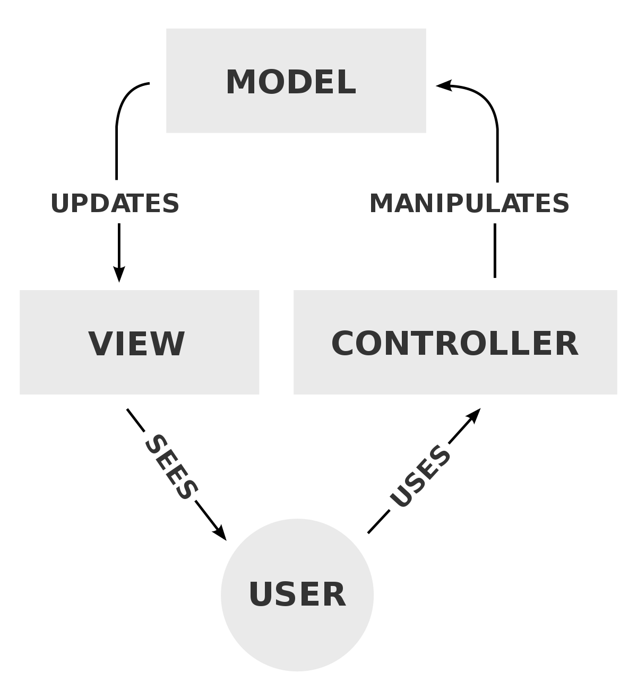

# 4일차 JSCODE 정리

## Controller, Service, Repository 구분하기

#### 계층분리가 필요한 이유
> 계층분리의 장점
> 1. 하나의 계층이 변경되더라도 다른 계층에 영향 없음.
> 2. 코드가 간결해짐
> 3. 중복 코드 리팩토링 쉬워짐(중복 코드 감소)
> 4. 확장에 용이함(다른 계층에 영향 없는 이유로 인해)
> 

### 분리된 계층 구조

### 1. MVC 패턴
어플리케이션을 세 가지 역할로 구분한 개발 방법론  
사용자가 입력을 담당하는 View를 통해 요청 전송
View에 의한 요청을 Controller가 받고,  
Controller는 Model(Repository)에서 데이터를 가져오고  
해당 데이터를 바탕으로 출력을 담당하는 View를 제어하여 사용자에게 전달.

MVC패턴 사용으로 Model이 변경되더라도, View와 Controller는 변경 필요가 없으며  
이러한 이유로 변경에 유리하다는 장점이 있음(View Controller의 경우에도 같음)


##### 1) Model(Repository) - 무엇을 할 것인가? (What Are We Gonna Do?)
어플리케이션이 무엇을 할 것인지 비즈니스 로직을 처리하는 역할을 담당함.  
주로 DB와 연동되어 **사용자가 입력한 데이터나 처리될 데이터를 가공하거나 조작**하는 부분이 이에 해당됨.
알고리즘 실행, CRUD 작용, 데이터 처리 등이 해당 Layer에서 일어난다.

##### 2) View - 우린 Model과 Controller에서 뭔가를 했다, 어떻게 보여주지?

##### 3) Controller - 어떻게 할 것인가? (How Are We gonna Make it happened?)
사용자의 요청이 처음으로 들어오는 지점이며, 주로 사용자의 요청을 처리하여 지정된 뷰에 모델 객체를 넘겨주는 역할을 한다.   
Model과 View의 중간다리 역할이라고 봐도 무방할 듯 하다.  
모델과 뷰에 대해 알고 있으며, 양쪽에서 변경내용을 통지받고, 해당 변경내용을 다른 한쪽에 통지한다.  
컨트롤러는 모델과 뷰에 대해 알고 있어야하며, 이를 모니터링해야한다.

---

# 미션 수행 과정 정리

### 📖 (연습문제) 상품 등록 api 역할 구분하기

상품 이름과 가격을 Body에 담아서 Post 요청을 보내면 랜덤으로 id값을 추가해서 데이터베이스에 설계해둔 Product 테이블에 데이터가 추가되는 기능이 필요합니다.

1. Product 객체 생성
```java
package com.jscode.jscode_day4.Entity;


import lombok.NoArgsConstructor;

@NoArgsConstructor
public class Product {


    private int id;
    private String name;
    private double price;

    public Product(int id, String name, double price) {
        this.id = id;
        this.name = name;
        this.price = price;
    }

    public Product(String name, double price) {
        this.name = name;
        this.price = price;
    }

    public int getId() {
        return id;
    }

    public void setId(int id) {
        this.id = id;
    }

    public String getName() {
        return name;
    }

    public void setName(String name) {
        this.name = name;
    }

    public double getPrice() {
        return price;
    }

    public void setPrice(double price) {
        this.price = price;
    }
}

```

ID 값은 랜덤으로 추가되는 사항이라, 랜덤으로 지정되는 건 ```Service```에서 할 지라도  
일단 Product 엔티티 자체는 고유 ID를 갖고 있어야 하기 때문에 필드로 지정했다.  

각각의 값의 용이한 변경과 접근을 위해 ```Getter```와 ```Setter```를 각각 설정했다.

처음에 Long 타입으로 지정하려다가, 이후에 ```Random```객체 사용과정에서 음수값의 아이디가 나와버려서 좀 당황한 나머지 INT로 바꾸긴 했다.  

하지만 아직 구현에 집중한 나머지 ID가 음수로 나오는 문제는 해결하지 못했다.

후술하겠지만, rand.nextInt()를 양수가 나올때까지 돌리는건 너무 비효율적이라 생각해서.  
(언제 양수가 나올지 예측하기 어렵기 때문에) 조금 더 생각해볼 계획이다.


2.ProductRepository 객체 생성
```java
package com.jscode.jscode_day4.Repository;

import com.jscode.jscode_day4.Entity.Product;
import java.lang.reflect.Member;
import java.util.ArrayList;
import java.util.HashMap;
import java.util.List;
import java.util.Map;
import java.util.Optional;
import java.util.Random;
import javax.print.attribute.HashPrintJobAttributeSet;
import org.springframework.stereotype.Repository;

@Repository
public class ProductRepository {

    private static final Map<Integer, Product> store = new HashMap<>();
    Random rand = new Random();

    public Product saveProduct(Product product){
        product.setId(rand.nextInt());
        store.put(product.getId(), product);

        return product;
    }

    public Optional<Product> findByName(String name){
        return store.values().stream().filter(product -> product.getName().equals(name))
            .findFirst();
    }

    public Optional<Product> findById(int id){
        return Optional.ofNullable(store.get(id));
    }

    public List<Product> findAll(){
        return new ArrayList<>(store.values());
    }

    public void clearStore(){
        store.clear();
    }


}
```

아직 JPA를 배우지 않았기 때문에 일단 메모리에만 ```Repository```를 구현하기로 했다.  
지금 코드를 다시보니 ```HashMap```의 인자로 ```Integer```와 ```Product```가 있는데,  
ID가 중복으로 있는게 의미가 있나 싶다, DB에서 ID를 관리할 걸 생각하면 엔티티에만 ```id```가 있고  
Repository상에는 ```id```가 없는게 맞지 않을까?  
하지만 지금 상황은 DB까지는 고려하지 않으니 일단 PASS 그리고 ```HashMap.get()``` 메소드를 통해 findById가 쉽게 구현되는점이 이롭다.  
아마 ```ArrayList```를 통해 구현했다면 ```Iter``` 돌리면서 id 찾아다녀야하지 않았을까.

```Optional``` 객체의 사용 방법에 대해 잘 모르겠었는데
일단 존재 목적 자체는 ```NPE(Null Pointer Exception)```의 방지라고 한다.
```Java 8``` 부터 지원하는 것으로 되어있다.

Optional 객체의 기본 사용법
```java
Optional<String> optional = Optional.of(value);
// value의 값이 null인 경우 NPE 발생, 즉 of메소드는 반드시 값이 있어야 하는 경우 사용

Optional<String> optional = Optional.ofNullable(value);
// value 변수의 값이 null일 수 있음, null인 경우 Optional.empty()가 반환됨.

Optional<String> optional = Optional.empty();
// Optional객체를 생성하되 비어있음, 객체 자체는 존재하나 어떤것도 참조하지 않음.
// Optional 객체는 미리 생성되어있는 싱글턴 인스턴스임.
```

Optional 객체 중간처리
```java
Optional.of("Mason").filter(v -> v.startsWith("Ma")).orElse("Not Ma");

Optional.of("ABC").filter(v -> v.startsWith("TDD")).orElse("Not TDD");

// filter 조건이 참이면 of 메소드 안의 값을, 아닌 경우 orElse() 안의 값을 리턴한다.

Optional.of("XYZ")
```

