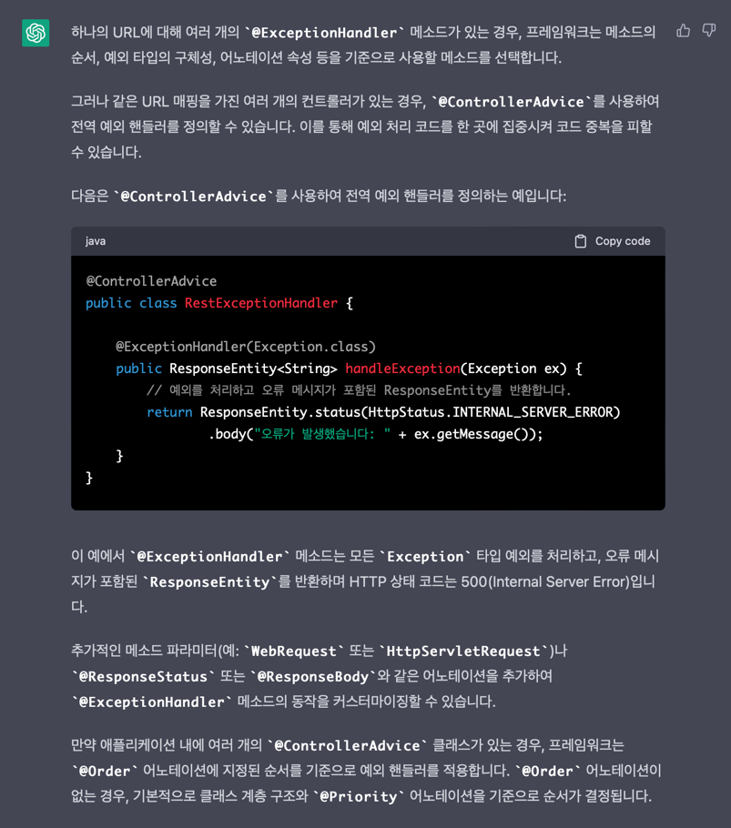

# 4일차 JSCODE 정리

## Controller, Service, Repository 구분하기

#### 계층분리가 필요한 이유
> 계층분리의 장점
> 1. 하나의 계층이 변경되더라도 다른 계층에 영향 없음.
> 2. 코드가 간결해짐
> 3. 중복 코드 리팩토링 쉬워짐(중복 코드 감소)
> 4. 확장에 용이함(다른 계층에 영향 없는 이유로 인해)
> 

### 분리된 계층 구조

### 1. MVC 패턴
어플리케이션을 세 가지 역할로 구분한 개발 방법론  
사용자가 입력을 담당하는 View를 통해 요청 전송
View에 의한 요청을 Controller가 받고,  
Controller는 Model(Repository)에서 데이터를 가져오고  
해당 데이터를 바탕으로 출력을 담당하는 View를 제어하여 사용자에게 전달.

MVC패턴 사용으로 Model이 변경되더라도, View와 Controller는 변경 필요가 없으며  
이러한 이유로 변경에 유리하다는 장점이 있음(View Controller의 경우에도 같음)


##### 1) Model(Repository) - 무엇을 할 것인가? (What Are We Gonna Do?)
어플리케이션이 무엇을 할 것인지 비즈니스 로직을 처리하는 역할을 담당함.  
주로 DB와 연동되어 **사용자가 입력한 데이터나 처리될 데이터를 가공하거나 조작**하는 부분이 이에 해당됨.
알고리즘 실행, CRUD 작용, 데이터 처리 등이 해당 Layer에서 일어난다.

##### 2) View - 우린 Model과 Controller에서 뭔가를 했다, 어떻게 보여주지?

##### 3) Controller - 어떻게 할 것인가? (How Are We gonna Make it happened?)
사용자의 요청이 처음으로 들어오는 지점이며, 주로 사용자의 요청을 처리하여 지정된 뷰에 모델 객체를 넘겨주는 역할을 한다.   
Model과 View의 중간다리 역할이라고 봐도 무방할 듯 하다.  
모델과 뷰에 대해 알고 있으며, 양쪽에서 변경내용을 통지받고, 해당 변경내용을 다른 한쪽에 통지한다.  
컨트롤러는 모델과 뷰에 대해 알고 있어야하며, 이를 모니터링해야한다.

---

# 미션 수행 과정 정리

### 📖 (연습문제) 상품 등록 api 역할 구분하기

상품 이름과 가격을 Body에 담아서 Post 요청을 보내면 랜덤으로 id값을 추가해서 데이터베이스에 설계해둔 Product 테이블에 데이터가 추가되는 기능이 필요합니다.

1. Product 객체 생성
```java
package com.jscode.jscode_day4.Entity;


import lombok.NoArgsConstructor;

@NoArgsConstructor
public class Product {


    private int id;
    private String name;
    private double price;

    public Product(int id, String name, double price) {
        this.id = id;
        this.name = name;
        this.price = price;
    }

    public Product(String name, double price) {
        this.name = name;
        this.price = price;
    }

    public int getId() {
        return id;
    }

    public void setId(int id) {
        this.id = id;
    }

    public String getName() {
        return name;
    }

    public void setName(String name) {
        this.name = name;
    }

    public double getPrice() {
        return price;
    }

    public void setPrice(double price) {
        this.price = price;
    }
}

```

ID 값은 랜덤으로 추가되는 사항이라, 랜덤으로 지정되는 건 ```Service```에서 할 지라도  
일단 Product 엔티티 자체는 고유 ID를 갖고 있어야 하기 때문에 필드로 지정했다.  

각각의 값의 용이한 변경과 접근을 위해 ```Getter```와 ```Setter```를 각각 설정했다.

처음에 Long 타입으로 지정하려다가, 이후에 ```Random```객체 사용과정에서 음수값의 아이디가 나와버려서 좀 당황한 나머지 INT로 바꾸긴 했다.  

하지만 아직 구현에 집중한 나머지 ID가 음수로 나오는 문제는 해결하지 못했다.

후술하겠지만, rand.nextInt()를 양수가 나올때까지 돌리는건 너무 비효율적이라 생각해서.  
(언제 양수가 나올지 예측하기 어렵기 때문에) 조금 더 생각해볼 계획이다.


2.ProductRepository 객체 생성
```java
package com.jscode.jscode_day4.Repository;

import com.jscode.jscode_day4.Entity.Product;
import java.lang.reflect.Member;
import java.util.ArrayList;
import java.util.HashMap;
import java.util.List;
import java.util.Map;
import java.util.Optional;
import java.util.Random;
import javax.print.attribute.HashPrintJobAttributeSet;
import org.springframework.stereotype.Repository;

@Repository
public class ProductRepository {

    private static final Map<Integer, Product> store = new HashMap<>();
    Random rand = new Random();

    public Product saveProduct(Product product){
        product.setId(rand.nextInt());
        store.put(product.getId(), product);

        return product;
    }

    public Optional<Product> findByName(String name){
        return store.values().stream().filter(product -> product.getName().equals(name))
            .findFirst();
    }

    public Optional<Product> findById(int id){
        return Optional.ofNullable(store.get(id));
    }

    public List<Product> findAll(){
        return new ArrayList<>(store.values());
    }

    public void clearStore(){
        store.clear();
    }


}
```

아직 JPA를 배우지 않았기 때문에 일단 메모리에만 ```Repository```를 구현하기로 했다.  
지금 코드를 다시보니 ```HashMap```의 인자로 ```Integer```와 ```Product```가 있는데,  
ID가 중복으로 있는게 의미가 있나 싶다, DB에서 ID를 관리할 걸 생각하면 엔티티에만 ```id```가 있고  
Repository상에는 ```id```가 없는게 맞지 않을까?  
하지만 지금 상황은 DB까지는 고려하지 않으니 일단 PASS 그리고 ```HashMap.get()``` 메소드를 통해 findById가 쉽게 구현되는점이 이롭다.  
아마 ```ArrayList```를 통해 구현했다면 ```Iter``` 돌리면서 id 찾아다녀야하지 않았을까.  

그리고 하나의 통합된 Repository여야 하기 때문에 프로그램 상에 여러개 있을 필요가 없는 ```store```의 경우 전역에 1개만 존재하도록 ```final```과 ```static```
키워드를 적용했다.  
```Optional``` 객체의 사용 방법에 대해 잘 모르겠었는데
일단 존재 목적 자체는 ```NPE(Null Pointer Exception)```의 방지라고 한다.
```Java 8``` 부터 지원하는 것으로 되어있다.

Optional 객체의 기본 사용법
```java
Optional<String> optional = Optional.of(value);
// value의 값이 null인 경우 NPE 발생, 즉 of메소드는 반드시 값이 있어야 하는 경우 사용

Optional<String> optional = Optional.ofNullable(value);
// value 변수의 값이 null일 수 있음, null인 경우 Optional.empty()가 반환됨.

Optional<String> optional = Optional.empty();
// Optional객체를 생성하되 비어있음, 객체 자체는 존재하나 어떤것도 참조하지 않음.
// Optional 객체는 미리 생성되어있는 싱글턴 인스턴스임.
```

Optional 객체 중간처리
```java
Optional.of("Mason").filter(v -> v.startsWith("Ma")).orElse("Not Ma");

Optional.of("ABC").filter(v -> v.startsWith("TDD")).orElse("Not TDD");

// filter 조건이 참이면 of 메소드 안의 값을, 아닌 경우 orElse() 안의 값을 리턴한다.

Optional.of("ABCD").map(String::toLowerCase);

// ABCD를 소문자로 변환함.

Optional.of("MyOption").isPresent(); // return true
Optional.of("MyOption").filter(f -> "TEST".equals(v)).isPresent() // return false

Optional.of("TEST").ifPresent() // ifPresent() 내부의 명령어 실행
// Optional 객체에 값이 없는 경우 내부 람다식 실행 X

Optional.of("TEST").get() // Optional로 감싸진 객체 내부의 원 객체 가져옴
// 중간 과정 중 비게되는 경우 .orElse() 메소드를 사용하면 메소드에 지정된 값이 기본 값으로 리턴된다.
```
사용법을 잘 모르는 상태에서 그렇구나~ 하면서 썼던거라 사용방법에 대해서 정리했다.

3. ProductController 객체 생성

```java
package com.jscode.jscode_day4.Controller;

import com.jscode.jscode_day4.Entity.Product;
import com.jscode.jscode_day4.Entity.ProductDTO;
import com.jscode.jscode_day4.Service.ProductService;
import java.util.List;
import java.util.Optional;
import lombok.extern.slf4j.Slf4j;
import org.springframework.web.bind.annotation.ExceptionHandler;
import org.springframework.web.bind.annotation.GetMapping;
import org.springframework.web.bind.annotation.PathVariable;
import org.springframework.web.bind.annotation.PostMapping;
import org.springframework.web.bind.annotation.RequestBody;
import org.springframework.web.bind.annotation.RequestParam;
import org.springframework.web.bind.annotation.RestController;

@RestController
@Slf4j
public class ProductController {

    private final ProductService productService;

    public ProductController(ProductService productService) {
        this.productService = productService;
    }

    // 상품 정보 등록 POST
    @PostMapping("/api/product")
    public void registerProduct(@RequestBody ProductDTO productDto){
        productService.saveProduct(productDto);
    }

    @GetMapping("/api/product/byName") // Rest하게 설계하고 싶었는데, 저거 안달면 Exception handler가 인식을 못하는 듯 함.
    public Product getProductInfoByName(
        @RequestParam(value = "name") String productName,
        @RequestParam(value = "monetaryUnit", defaultValue = "won")
        String monetaryUnit){
        Product product = productService.findByName(productName, monetaryUnit);
        return product;
    }

    // 상품 정보 GET
    @GetMapping("/api/products")
    public List<Product> getAllProductInfo(@RequestParam(value = "monetaryUnit", required = false, defaultValue = "won") String monetaryUnit){
        return productService.getAllProducts(monetaryUnit);
    }

    @GetMapping("/api/product/{productId}")
    public Product getProductInfoById(@PathVariable int productId, @RequestParam("monetaryUnit") String monetaryUnit){
        Product product = productService.findById(productId, monetaryUnit);
        return product;

    }
    
}
```

컨트롤러를 작성하면서 마주친 오류들에 대해 기록하고, 해결 방법을 어떻게 찾았는지도 기록하겠다.

```Ambiguous handler methods mapped for <Http Path>```  

```REST```하게 설계하기 위해 모든 URL Pattern을 일치시킨 상태에서 시작했는데,  
예외 처리를 위해 ```ExceptionHandler```를 사용하는 과정에서 문제가 발생했다.
```IllegalArgumentException```의 경우 동일한 이름을 가진 상품이 2번 이상 등록되는 경우  
서비스단에서 예외가 터지도록 설계했고, ```IllegalStateException```의 경우 이름이 없는 상품을
검색할 경우, 예외가 터지도록 설계했는데 전자는 잘 터지는데, 후자가 에러메세지가 뜨는 문제가 있었다.

아래 내용은 코드를 작성하면서 배운 ```RestControllerAdvice```와 ```ExceptionHandler```를 사용한 예외처리 컨트롤러이다.

```java
package com.jscode.jscode_day4.Controller;

import org.springframework.web.bind.annotation.ControllerAdvice;
import org.springframework.web.bind.annotation.ExceptionHandler;
import org.springframework.web.bind.annotation.RestControllerAdvice;

@RestControllerAdvice
public class ExceptionController {

    @ExceptionHandler
    public String handleException(IllegalArgumentException e){
        return e.getMessage();
    }

    @ExceptionHandler
    public String handleException(IllegalStateException e){
        return e.getMessage();
    }

}
```

검색을 해보니 하나의 URL을 여러개의 컨트롤러에서 매핑할 수 없다고 한다.  
Chat-GPT에게 해결책을 물으니 다음과 같이 답변했는데

이건 핸들러를 깊게 공부한 뒤 해봐야할 듯 하다.  

(일단 기본적인 사용법과 응용을 익힌 뒤 깊이있게 들어가겠다, 스프링 강의를 들으면서 느낀거지만
양이 너무 방대해서 내 것으로 못만들고 넘어간게 너무 많다)

추가로 궁금한 것은 이것이었다.
저런식으로 구현하고 나면, JSON형태로 예외처리가 반환되는것이 아니라 ```e.getMessage()```에 의해 반환된 문자가 그대로 ResponseBody에 출력되는데 이걸 좀 JSON 형식으로 바꿔보고 싶다  
일단 핸들러 매핑 부분을 주의깊게 공부하고 다시 작성하도록 하겠다.

3. 마지막으로 ProductService 코드는 아래와 같이 작성했다.
```java
package com.jscode.jscode_day4.Service;

import com.jscode.jscode_day4.Entity.Product;
import com.jscode.jscode_day4.Entity.ProductDTO;
import com.jscode.jscode_day4.Repository.ProductRepository;
import java.util.List;
import java.util.Optional;
import java.util.stream.Collectors;
import javax.swing.text.html.Option;
import org.springframework.http.HttpStatus;
import org.springframework.stereotype.Service;
import org.springframework.web.bind.annotation.ExceptionHandler;
import org.springframework.web.bind.annotation.ResponseStatus;

@Service
public class ProductService {

    private final ProductRepository productRepository;

    public ProductService(ProductRepository productRepository) {
        this.productRepository = productRepository;
    }

    public Product saveProduct(ProductDTO productDto){
        Product product = new Product(productDto.getName(), productDto.getPrice());
        ifSameNameOfProductExistException(product);
        return productRepository.saveProduct(product);
    }


    public List<Product> getAllProducts(String monetaryUnit){

        List<Product> allProductList = productRepository.findAll();

        if(monetaryUnit.equals("dollar")){
            List<Product> updatedList = allProductList.stream()
                .map(p -> new Product(p.getId() ,p.getName(), p.getPrice()/1200.))
                .collect(Collectors.toList());
            return updatedList;
        }

        return allProductList;
    }

    public Product findById(int productId, String monetaryUnit){
        Product product = productRepository.findById(productId).get();
        if(monetaryUnit.equals("dollar")){
            return new Product(product.getId() ,product.getName(), product.getPrice()/1200.);
        }
        return product;
    }

    public Product findByName(String productName, String monetaryUnit){

        ifProductNameNoMatchesException(productName);
        Product product = productRepository.findByName(productName).get();
        if(monetaryUnit.equals("dollar")){
            return new Product(product.getId() ,product.getName(), product.getPrice()/1200.);
        }
        return product;
    }

    private void ifProductNameNoMatchesException(String productName) {
        if(productRepository.findByName(productName).isEmpty()){
            throw new IllegalStateException("해당 상품이 존재하지 않습니다");
        }
    }

    private void ifSameNameOfProductExistException(Product product) {
        if(productRepository.findByName(product.getName()).isPresent()){
            throw new IllegalArgumentException("동일한 상품이 존재합니다");
        }
    }
    
}
```

특정 조건을 만족하면 달러를 표시하게 하는 문제에서 떠오른 방법은 3가지다.
1. 엔티티 자체에 달러 필드를 생성하고 생성될때마다 변환해서 저장해놓기
2. 서비스 계층에서 특정 조건을 만족할 경우, 달러를 변환해서 출력하기
> 2.1 달러로 변환하고 새 ```Product``` 객체에 담아서 반환하는 방식  
> 2.2 달러를 변환하고 변환한 값을 ```price```에 넣어 원 ```Product```를 반환하는 방식
> 

나는 2.2를 선택했는데, 먼저 달러를 모든 경우 표시해야할 필요가 없고 지금 수준에서는 ```dollarPrice``` 필드를 새로 만들어야 할 만큼 필요가 없다고 생각했다.  
그렇다고 2.1 방식을 사용하면 어떤 객체는 환율이 달러가 되어있는 상태로 저장될테고, 어떤 객체는 환율이 원형태로 저장될텐데 이렇게되면 클래스 간 필드에 일관성이 떨어지고 모호성이 증가된다.

따라서 그냥 임시 객체 ```Product```를 만들고, 원 객체 ```Product```에서 모든 값을 끌고 오게 하되 ```Price``` 필드만 달러로 변환해서 저장하게 했다  
(오직 달러 표시를 위한 임시객체)  

맘에 들지 않는 지점이 몇 부분 있었는데
먼저 예외처리를 Method Extraction을 통해 Refactoring한건 깔끔해서 좋지만
```java
if(monetaryUnit.equals("dollar")){
    return new Product(product.getId() ,product.getName(), product.getPrice()/1200.);
    }
```

이 코드가 자꾸 눈에 밟힌다, ```findByName```, ```findById```에 연이어있는데 저것도 뽑아내버리고 싶은데 인텔리제이에서 Method Extraction을 실행하면 그대로 다른 메소드에서 적용할 수 있는 코드가 안나온다.  
이 부분도 고민해 볼 필요가 있겠다.

참고로 코드에서 ```monetaryUnit``` 이 부분은 초반에 예외처리할때 Restful하게 설계할 수 없었어서 ```Controller``` 부분을 보면  ```@RequestParam``` 형식으로 가져오거나, ```@PathVariable```을 통해 가져오도록 했다.  
둘 다 가능한데 어떤 걸 쓰는게 좋은지는 잘 모르겠다  
(상황에 맞게 써라! 가 보나마나 답일 것 같은데, 그 상황을 알려면 경험밖에는 답이 없지 않을까)


## 질문
1. 어제까지만 해도 정상적으로 작동하던 코드가, 예외처리부분을 ```@ExceptionHandler```와 ```@RestControllerAdvice```를 통해 구현하고 실행하는 과정중에서 ```Cannot construct instance of `com.jscode.jscode_day4.Entity.ProductDTO` (no Creators, like default constructor, exist): cannot deserialize from Object value (no delegate- or property-based Creator)``` 라는 오류가 발생합니다.  
좀 검색을 해봤더니 ```NoArgsConstructor```를 추가해야하고 이 부분이 JPA에서의 프록시와 지연로딩과 연관이 있다고 하는데 사실 현 시점에서는 JPA는 쓰지 않은 상태이고 메모리에서만 실습을 진행중인데, 저 오류가 왜 뜨는건지 모르겠습니다...?  
일단 문제는 NoArgsConstructor를 추가하는 방식으로 해결되었습니다!


2. 올바르게 글을 작성하는 방법이 궁금합니다
> 글을 작성할때 현재 제가 주로 쓰는 접근법은 문제 중심으로 어떻게 풀어 나갔는가에 대해 서술하는 방식인데  
> 글을 쓸 때마다 이 코드 저 코드 끌어와서 설명해야할 때가 많고 이렇다보면 전체적으로 글 흐름이 난잡해지는 경우가 있는 것 같습니다.
> 글을 작성하고 나니 설명이나 글 표현이 전체적으로 모호한 기분이 들어서 어떤 글쓰기가 앞으로 팀원들의 (또는 일할 곳의 선임/동료) 정신건강에 도움이 될지
> 조언을 부탁드리겠습니다.