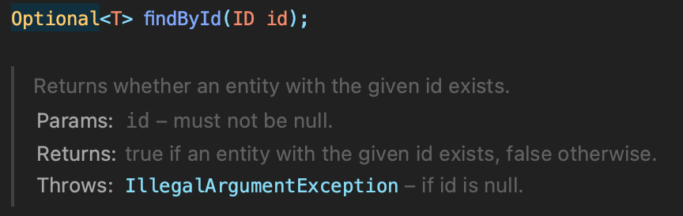
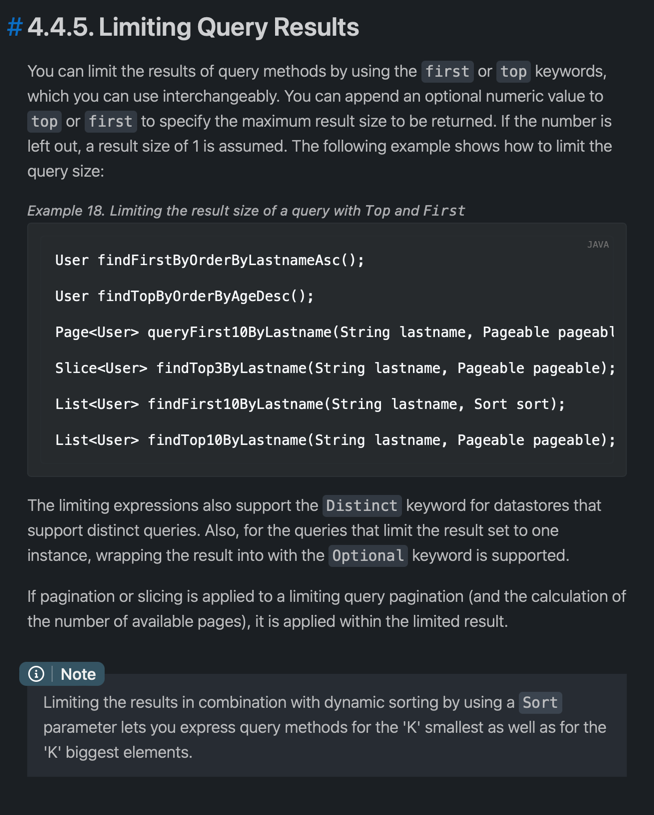

# 6일차 과제

### ✅  예제, 연습문제 구현하기

상품 전체 조회, 상품 등록 api를 구현하는 예제와 연습문제까지 진행하고 그 과정에서 배운점들을 정리해주세요.

먼저 API 구성을 위해 ```ProductEntity``` 객체를 생성했다
```java
package com.jscode.day6;

import javax.persistence.Column;
import javax.persistence.Entity;
import javax.persistence.GeneratedValue;
import javax.persistence.GenerationType;
import javax.persistence.Id;
import javax.persistence.Table;
import lombok.Getter;

@Table
@Entity
@Getter
public class ProductEntity {

    @Id
    @GeneratedValue(strategy = GenerationType.IDENTITY)
    private Long id;

    @Column
    private String name;

    @Column
    private Long price;

    public ProductEntity() {

    }
}

```
그리고 Spring Data JPA 사용을 위해 ```ProductJpaRepository``` 클래스를 생성했고, 이 클래스는 ```JpaRepository```의 상속을 받는다
```java
package com.jscode.day6;

import java.util.List;
import org.springframework.data.jpa.repository.JpaRepository;
import org.springframework.data.jpa.repository.Query;
import org.springframework.data.repository.query.Param;

public interface ProductJpaRepository extends JpaRepository<ProductEntity, Long> {
    List<ProductEntity> findByName(String name);


    List<ProductEntity> findByPrice(Long price);

    @Query(value = "select productEntity "+ "from ProductEntity productEntity "+
    "where productEntity.name = :name AND productEntity.price = :price")
    List<ProductEntity> findByNameAndPrice(@Param("name") String name, @Param("price") Long price);
}
```

이전에 김영한 선생님 강의에서는 JPA를 이용해야 했기에 Stream과 Optional, List와 HashMap Iteration 등 신경 써야 할 부분이 많았는데  
이 모든 문제들이 Spring Data JPA를 사용함으로써 말끔히 해결됐다.  
처음부터 이걸 썼으면 바로 프로젝트로 갈 수 있었을텐데라는 생각도 한편으로는 들었지만, JPA와 JDBC 실습을 해봤기 때문에  
```@Query``` 애노테이션도 적절하게 활용할 수 있었으리라 생각한다.

JPA를 공부하면서 왜 ```ProductEntity```가 쿼리문 안에 들어가는지 고민했던 적이 있었는데 답변을 적어두자면,  
저 ```@Query``` 는 DB로 직접 쏘는 쿼리가 아니라 Java Spring Framework 안에서 **객체를 대상으로 한 쿼리**이기 때문에  
쿼리문 처럼 보여도 DB로 가는게 아니라는 점을 기억해야했다.  

데이터베이스와 ORM으로 상호작용하긴 하지만, 스프링 내에서 일어나는 일은 전부 자바 객체를 이용해 일어난다.  
(객체 불일치 문제도 있고 로딩이 안되는 경우도 있어서 생긴게 프록시, LazyLoading ---> 자세한 건 JPA 강좌 참고 (길어요, 아주 많이)

Return Type에 따라서 알아서 Query를 날려주니 아주 편했다.  
하지만 어렸을 적 선생님은 말씀하셨다. 말의 뜻을 알고 써야 한다고, 내부 구조를 알 필요는 분명히 있을테지만  
일단 나는 프로젝트가 해보고 싶고, 그 과정에서 문제가 생기면 내부를 파보면서 이해하고 싶기 때문에 PASS  

```java
@Query(value = "select productEntity "+ "from ProductEntity productEntity "+
    "where productEntity.name = :name AND productEntity.price = :price")
    List<ProductEntity> findByNameAndPrice(@Param("name") String name, @Param("price") Long price);
```
여기서 ```@Query``` 안에 들어간 parameter인 ```:name```과 ```:price```의 경우 하단의 ```findByNameAndPrice``` 메서드의 Parameter에서 꼭 ```@Param```을 통해 바인딩 해주어야 한다.  
바인딩을 해주지 않았어서, 나는 여기서 오류를 맞이했다.

다음으로, 서비스 코드를 작성했다.
```java
package com.jscode.day6;

import java.util.List;
import java.util.NoSuchElementException;
import org.springframework.stereotype.Service;

@Service
public class ProductService {
    private final ProductJpaRepository productJpaRepository;

    public ProductService(ProductJpaRepository productJpaRepository) {
        this.productJpaRepository = productJpaRepository;
    }

    public List<ProductEntity> findAll() {
        return productJpaRepository.findAll();
    }

    public ProductEntity findById(Long id){
        return productJpaRepository.findById(id).orElseThrow(NoSuchElementException::new);
    }

    public List<ProductEntity> findByName(String name){
        return productJpaRepository.findByName(name);
    }

    public List<ProductEntity> findByNameAndPrice(String name, Long price){
        return productJpaRepository.findByNameAndPrice(name, price);
    }

    public List<ProductEntity> findByPrice(Long price){
        return productJpaRepository.findByPrice(price);
    }

    public ProductEntity save(ProductEntity product){
        return productJpaRepository.save(product);
    }
}

```

여기서 보면 ```findById``` 메소드에서 ```Optional```이 사용된 것을 알 수 있는데,

이런식으로 구현되어있었다.
```NullPointerException``` 방지를 위해 사용한 듯 한데,  
그냥 ```.get()```을 통해 가져와버리면 의미가 퇴색되는 것 같아서 ```.orElseThrow()```를 통해  
값이 없으면 ```NoSuchElementException()```을 띄울 수 있도록 코드를 작성했다.  

뒤에 ```NoSuchElementException::new```에 관한 문법은 새로운 문법인데(사실 이전에 자바 스터디 할때 봄)  
자바 람다로 쳤는데 안나온다....? ChatGPT한테 좀 이따 물어봐야겠다.


```java
package com.jscode.day6;

import java.util.List;
import lombok.extern.slf4j.Slf4j;
import org.springframework.web.bind.annotation.GetMapping;
import org.springframework.web.bind.annotation.PostMapping;
import org.springframework.web.bind.annotation.RequestBody;
import org.springframework.web.bind.annotation.RequestParam;
import org.springframework.web.bind.annotation.RestController;

@RestController
@Slf4j
public class ProductController {

    private final ProductService productService;

    public ProductController(ProductService productService){
        this.productService = productService;
    }

    @PostMapping("/api/product")
    public ProductEntity saveProduct(@RequestBody ProductEntity product){
        return productService.save(product);
    }

    @GetMapping("/api/products")
    public List<ProductEntity> getAllProducts(){
        return productService.findAll();
    }

    @GetMapping("/api/product")
    public List<ProductEntity> getProduct
        (
            @RequestParam(value = "name", required = false) String name,
            @RequestParam(value = "price", required = false) Long price){

        if(name != null && price != null){
            return productService.findByNameAndPrice(name, price);
        }

        if(name != null){
            return productService.findByName(name);
        }

        return productService.findByPrice(price);


    }

    @GetMapping("/api/product/getbyid")
    public ProductEntity getProductById(
        @RequestParam(value = "id", required = true) long id
    ){
        return productService.findById(id);
    }


}

```

컨트롤러에서 고민한 사항은 밑에 심화 미션에서 ```name```과 ```price``` 두 조건 모두 만족하는 쿼리를 받아봐라 였는데 둘 중 하나만 왔을때는 어떻게 하느냐를 고민하는 와중에 저렇게 코드를 작성했는데 맘에 들지 ... 않는데 모그님 어떻게 작성하는게 좋을까요 ㅠㅠ
  
저건 Method Extraction도 안되고,,,  
오버로딩하면 ambiguous하다고 컴파일 오류나고  
if문으로 떡칠한것 같아서 기분이 별롭니다...


### ✅  상품 상세조회 구현하기

`api/products?id=1` 로 요청하면 id가 1인 상품을 데이터베이스 테이블에서 찾아서 리턴하는 api를 구현해보세요.

-> 위 코드 확인해주세요~

### ✅  (심화) 이름으로 상품 상세조회 구현하기

`api/products?name=모니터` 와 같이 요청하면 해당 name을 가진 상품을 데이터베이스 테이블에서 찾아서 리턴하는 api를 구현해보세요.

> key값으로 찾는 find가 아니라면 ProductJpaRepository에서 함수를 선언해줘야 합니다.
JPA 인터페이스 내에서 구현 없이 선언만 해주면 선언한 **메소드 이름**으로 적절한 JPQL쿼리를 생성해서 실행해주는 아주 편리한 기능을 탑재하고 있습니다.
>

[[jpa] Spring Data JPA](https://joont92.github.io/jpa/Spring-Data-JPA/)

[Spring Data JPA - Reference Documentation](https://docs.spring.io/spring-data/jpa/docs/current/reference/html/#repositories.query-methods)

- 힌트

    ```java
    public interface ProductJpaRepository extends JpaRepository<Product, Long> {
        List<Product> findByName(String name);
    }
    ```


### ✅ (심화) 요구사항 만족하는 상품 조회 메소드 구현하기

> *JPA 인터페이스 내에서 구현 없이 선언만 해주면 선언한 **메소드 이름**으로 적절한 JPQL쿼리를 생성해서 실행해주는 아주 편리한 기능* 을 활용해보기 위한 미션입니다. JPA 인터페이스 내 메소드의 이름을 통해서 아래 요구사항을 만족하는 기능을 구현해봅시다!
>
- `api/products?price=1000` 으로 요청하면 `price`가 1000원인 상품들 리스트를 `name`을 기준으로 정렬해서 조회하세요.
    - `name` 기준 내림차순 정렬
- `api/products?name=모니터&price=1000` 으로 요청했을 때 요청된 name과 price값을 모두 만족(and)하는 상품 리스트를 조회하세요.

<aside>
💡 아래 부터는 API로 까지는 구현하진 않아도 됩니다. 요구사항에 맞는 상품 리스트를 조회하는 메소드를 jpa에 선언하고고, 테스트만 해보세요.

</aside>

단순 메소드 이름 뿐만 아니라 `@Query` 어노테이션이 필요할 수 있습니다. 아래 블로그를 참고해주세요. `@Query` 어노테이션을 활용한 조회도 꼭 해보시길 바랍니다!

[[Spring Data JPA] JPQL 사용 방법(@Query & nativeQuery & DTO Mapping & function)](https://velog.io/@youmakemesmile/Spring-Data-JPA-JPQL-사용-방법Query-nativeQuery-DTO-Mapping-function)

- 전체 상품을 조회하는데, name이 모니터인 상품은 무시
- 가장 가격이 비싼 상품 조회하기
- 이름에 “컴”을 포함하는 상품 조회하기
- 가장 가격이 저렴한 상품의 ‘이름만’ 조회하기
- 상품 가격의 평균 구하기
```java

package com.jscode.day6;

import java.util.List;
import org.springframework.data.jpa.repository.JpaRepository;
import org.springframework.data.jpa.repository.Query;
import org.springframework.data.repository.query.Param;

public interface ProductJpaRepository extends JpaRepository<ProductEntity, Long> {
  List<ProductEntity> findByName(String name);
  List<ProductEntity> findByPrice(Long price);

  @Query(value = "select productEntity "+ "from ProductEntity productEntity "+
          "where productEntity.name = :name AND productEntity.price = :price")
  List<ProductEntity> findByNameAndPrice(@Param("name") String name, @Param("price") Long price);

    /*
    * 전체 상품을 조회하는데, name이 모니터인 상품은 무시

    가장 가격이 비싼 상품 조회하기

    이름에 “컴”을 포함하는 상품 조회하기

    가장 가격이 저렴한 상품의 ‘이름만’ 조회하기

    상품 가격의 평균 구하기*/

  // Select * FROM ProductEntity WHERE NOT name="모니터"
  // SELECT * FROM ProductEntity ORDER BY ProductEntity.price DESC Limit 0 1
  // SELECT * FROM ProductEntity WHERE name="*컴*"
  // SELECT ProductEntity.name FROM ProductEntity ORDER BY ProductEntity.Price DESC
  // SELECT AVG(ProductEntity.price) FROM ProductEntity

  @Query(value = "select productEntity "+ "from ProductEntity productEntity "+
          "WHERE NOT productEntity.name = '모니터'")
  List<ProductEntity> listAllHasNameMonitor();


  @Query(value = "select * from product_entity ORDER BY price desc limit 1", nativeQuery = true)
  List<ProductEntity> productWhichIsMostExpensive();

  @Query(value = "select * from product_entity ORDER BY price ASC limit 1", nativeQuery = true)
  List<ProductEntity> productWhichIsMostCheapest();

  @Query(value = "select productEntity " + "from ProductEntity productEntity "
          + "WHERE productEntity.name LIKE '%컴%' ")
  List<ProductEntity> productWhichHasCharacter();

  @Query(value = "select productEntity.name " + "from ProductEntity productEntity "
          + "order by productEntity.price desc")
  List<ProductEntity> productOrderByPricePrintingName();

  @Query(value = "select avg(productEntity.price) " + "from ProductEntity productEntity")
  long productAvgPrice();

  
}
```

다음은 위 5 문제를 해결하기 위해 작성한 코드인데 몇가지 짚고 넘어가야 할 부분이 있어서 작성했다.  
먼저 Spring Data JPA는 MYSQL쿼리문을 모두 지원하지는 않는다.  
```LIMIT```를 이용해 가격이 가장 비싸고 싼 항목의 이름을 출력하는 과정에서 ```unexpected token : LIMIT```라는 오류가 발생했고 여러 번 검색을 거친 결과, ````nativeQuery```` 옵션을 ```True```로 설정하고 NativeQuery를 사용해줘야 했다.  

일단 Native Query를 사용하면 JPA에서 아직 실행되지 않은 Commit이 실행된다고 알고 있다. (1차 캐시 플러싱)  
해주는 이유는 객체가 DB에 업데이트가 되지 않은 상태에서 쿼리가 나가버리면, 말 그대로 반영이 안된 데이터 불일치 문제가 생기기 때문
쿼리가 자주 나갈수록 비용이라는데 **````nativeQuery```` 옵션의 변경 없이 Data JPA만으로 Pagination을 해결할 수 밖에 없는지 궁금합니다**  
찾아본 결과 QueryDSL을 사용하는 방식으로 해결방법을 찾은게 있던데, 아직 QueryDSL까지는 배우지 않았으니(과유불급) 여쭙겠습니다!  

https://tecoble.techcourse.co.kr/post/2021-08-15-pageable/  
찾아본 결과 ```Pageable```을 이용한 해답이 있군용!  
```ProductJpaRepository```의 ```productWhichIsMostExpensive``` 메소드의  parameter로 ```Pageable pageable```을 주면 컨트롤러에서 Parameter로 Query 대상을 주면 비슷하게는 만들 수 있는 듯 합니다!

*** 혹시라도 나중에 가능하시면 Java Lambda에 관해서 간략하게 설명해주실 수 있으실까요...?  
솔직히 이것 저것 찾아보고는 있는데 많이 생소합니다... ```p -> {}``` 이런 구조나 ```IllegalStateException::new``` 난생 처음봅니다.


  
더 쉬운 방법이 있었네요... 역시 공식 문서부터 찾아보는게 좋은 듯 합니다.

이상입니다!
